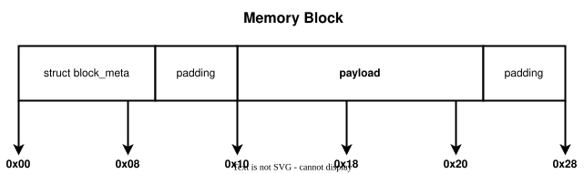
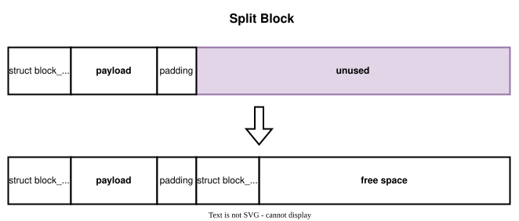
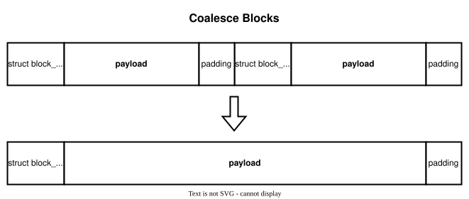

# Memory Allocator

A minimalistic, from-scratch implementation of `malloc()`, `calloc()`, `realloc()`, and `free()` in C, built directly on top of the `brk()`/`sbrk()` and `mmap()`/`munmap()` syscalls.

The library manages its own heap: it tracks memory blocks with an explicit linked list, reuses freed blocks (splitting and coalescing them as needed), preallocates the heap on first use to cut down on syscalls, and falls back to `mmap()` for large allocations.

## Status

| Function     | Implemented |
|--------------|:-----------:|
| `os_malloc`  | ✅ |
| `os_calloc`  | ✅ |
| `os_realloc` | ✅ |
| `os_free`    | ✅ |

All 40 functional test programs from the official test suite (see [Testing](#testing)) pass on this implementation.

## How it works

Each allocated zone is a **block**: a `struct block_meta` header immediately followed by the payload. Every function returns/accepts a pointer to the *payload*, not the header.

```c
struct block_meta {
	size_t size;
	int status;              // STATUS_FREE / STATUS_ALLOC / STATUS_MAPPED
	struct block_meta *prev;
	struct block_meta *next;
};
```



- **Alignment** — every payload address and every block size is rounded up to a multiple of 8 bytes.
- **Heap preallocation** — the first heap allocation reserves 128 KB via `sbrk()` in one shot, so later small allocations are served by splitting that chunk instead of growing the heap repeatedly.
- **Split** — when a free block is larger than needed, it's cut into a used block of the exact size and a new free block with the remainder (only if the remainder can still hold a header + 1 byte).

  

- **Coalesce** — adjacent free blocks are merged into one before searching for a fit, and again in `os_realloc()` when trying to grow a block in place.

  

- **Best fit** — allocation searches the whole free list and picks the smallest block that still satisfies the request, to reduce wasted space.
- **mmap threshold** — allocations at or above `MMAP_THRESHOLD` (128 KB) bypass the heap entirely and go straight to `mmap()`/`munmap()`.
- **`os_realloc()`** tries to grow in place first (coalescing trailing free blocks one at a time), extends the last block with `sbrk()` if it's at the end of the heap, and only copies to a new block as a last resort. Growing/shrinking a mapped block always allocates a fresh region and copies.

## Repository layout

```
src/            osmem.c — the allocator implementation, builds into libosmem.so
utils/          osmem.h, block_meta.h — the library interface / shared types (support code)
                printf.c/.h — a printf implementation that doesn't touch the heap
tests/ref/      expected ltrace output for the official checker (checked in)
tests/local/    small standalone sanity test, no external tooling required
```

`tests/snippets/` (the official test *sources*) is intentionally not checked into this repo — see [Testing](#testing) for how to get them back.

## Building

```console
$ cd src/
$ make
```

This produces `src/libosmem.so`.

> macOS note: `osmem.c` includes `<stdlib.h>` explicitly for `exit()` (used by the `DIE()` macro). This is required to build with the Xcode/Clang toolchain on macOS; it's a no-op on Linux, where the header is normally pulled in transitively.

## Testing

This assignment ships with an official grader (`tests/run_tests.py`) that runs each test under `ltrace`, diffs the captured `brk`/`mmap`/`munmap` calls against `tests/ref/*.ref`, and cross-checks for leaks with `valgrind`. That grader is Linux-only (`ltrace` has no macOS build) and needs the test *sources* in `tests/snippets/*.c`, which aren't tracked in this repo (see `.gitignore`) and are normally provided by the course's checker image.

Two ways to actually exercise the allocator:

### 1. Quick local sanity check (any platform, no extra tooling)

```console
$ cd tests/local/
$ make run
```

This builds `libosmem.so` and runs `test_local.c`, a self-contained suite (~800 assertions) covering zero-size calls, alignment, calloc zero-fill, split/coalesce/block-reuse, the `mmap` threshold, `realloc` grow/shrink/move semantics, and an interleaved alloc/free stress test.

### 2. Official checker (Linux, `ltrace` + `valgrind` installed, test sources available)

```console
$ cd tests/
$ make check        # builds libosmem.so + all snippets, then runs run_tests.py
$ make check-fast    # same, but skips the valgrind leak pass
```

If `tests/snippets/*.c` is missing, restore it from git history (it was removed at commit `aa95cae`):

```console
$ mkdir -p tests/snippets
$ for f in $(git ls-tree -r aa95cae~1 --name-only -- tests/snippets/); do
    git show "aa95cae~1:$f" > "$f"
  done
```

Run a single test with `python3 run_tests.py <test-name>`; add `-v` for verbose output or `-d` for a diff on failure.

## API

- `void *os_malloc(size_t size)` — `size == 0` returns `NULL`. Below `MMAP_THRESHOLD` bytes, served from the heap; otherwise from `mmap()`. Memory is uninitialized.
- `void *os_calloc(size_t nmemb, size_t size)` — `nmemb == 0 || size == 0` returns `NULL`. Same heap/mmap split as `os_malloc`, threshold is the system page size. Memory is zeroed.
- `void *os_realloc(void *ptr, size_t size)` — `ptr == NULL` behaves like `os_malloc(size)`; `size == 0` behaves like `os_free(ptr)`. Tries to expand in place before copying. Calling it on an already-freed block returns `NULL`.
- `void os_free(void *ptr)` — marks heap blocks free for reuse; `munmap()`s mapped blocks. Never shrinks the heap back to the OS.

## Resources

- ["Implementing malloc" slides by Michael Saelee](https://moss.cs.iit.edu/cs351/slides/slides-malloc.pdf)
- [Malloc Tutorial](https://danluu.com/malloc-tutorial/)
